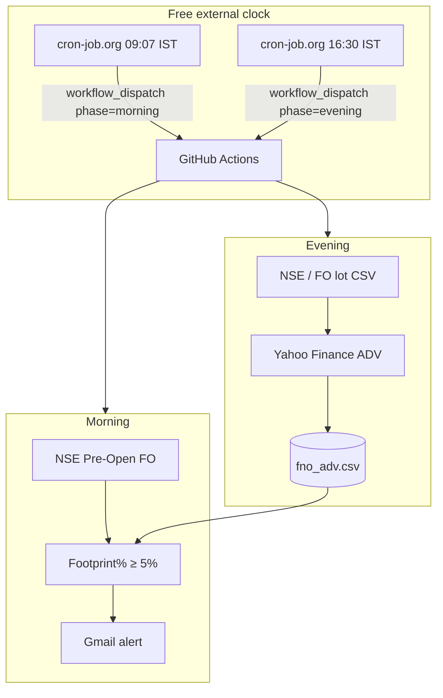

# trade_bot

NSE F&O pre-open institutional footprint monitor. Two weekday phases: evening ADV harvest, morning pre-open scan with email alerts.

## Why it was late

GitHub Actions `schedule` cron is **best-effort**. On this repo the morning job (intended **09:07 IST / 03:37 UTC**) has been starting around **11:30–12:20 IST** — ~2.5–3 hours late, after cash market open. That is platform queue delay, not a bug in the Python scripts.

**Fix (still $0):** keep Actions as the runner, but fire it on time with a free external cron via `workflow_dispatch`.

## On-time setup (free)

### 1. Repo secrets

Settings → Secrets → Actions:

| Secret | Value |
|---|---|
| `SENDER_EMAIL` | Gmail address |
| `SENDER_PASSWORD` | [Gmail App Password](https://myaccount.google.com/apppasswords) |
| `RECEIVER_EMAIL` | Alert destination |

Settings → Actions → General → Workflow permissions → **Read and write**.

### 2. Fine-grained PAT for the external cron

GitHub → Settings → Developer settings → Personal access tokens:

- Permission: **Actions: Read and write** (repo scope)
- Copy the token once

### 3. cron-job.org (free) — two jobs

Create an account at [cron-job.org](https://cron-job.org). For each job:

**URL**
```
https://api.github.com/repos/chaitanyajerripothula/trade_bot/actions/workflows/main.yml/dispatches
```

**Method:** `POST`  
**Headers:**
```
Authorization: Bearer <YOUR_PAT>
Accept: application/vnd.github+json
Content-Type: application/json
```

**Morning body** (09:07 IST = 03:37 UTC, Mon–Fri):
```json
{"ref":"main","inputs":{"phase":"morning"}}
```
Schedule: `37 3 * * 1-5` (UTC) or use cron-job.org timezone = Asia/Kolkata at 09:07.

**Evening body** (16:30 IST = 11:00 UTC, Mon–Fri):
```json
{"ref":"main","inputs":{"phase":"evening"}}
```
Schedule: `0 11 * * 1-5` UTC or 16:30 Asia/Kolkata.

`workflow_dispatch` does **not** sit in GitHub’s delayed schedule queue — it usually starts within seconds.

You can leave the built-in `schedule:` in the workflow as a backup; treat cron-job.org as the real clock.

### 4. Smoke test

Actions → **End-to-End Institutional Pre-Open Suite** → Run workflow → choose `morning` or `evening`.

## How it works



| Piece | Role |
|---|---|
| `generate_adv.py` | Builds `fno_adv.csv` (Symbol → 20Day_ADV) |
| `pre_open_monitor.py` | Live pre-open scan + ≥5% footprint filter + email |
| `.github/workflows/main.yml` | Runner for `morning` / `evening` phases |
| `graphify-out/` | Architecture knowledge graph |

## Manual local run

```bash
pip install requests pandas yfinance
python generate_adv.py
SENDER_EMAIL=... SENDER_PASSWORD=... RECEIVER_EMAIL=... python pre_open_monitor.py
```
