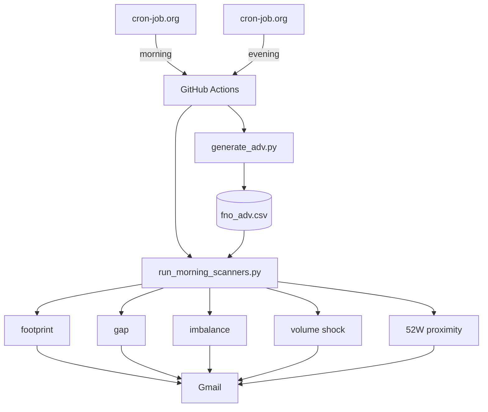

# trade_bot

NSE F&O pre-open multi-scanner suite. Evening ADV harvest; morning runs independent scanners and emails hits.

## Scanners (each file independent)

| File | Signal |
|---|---|
| `scanners/footprint_scanner.py` | Matched pre-open vol ≥ **5%** of 20-day ADV |
| `scanners/gap_scanner.py` | \|IEP % chg\| ≥ **1.5%** |
| `scanners/imbalance_scanner.py` | \|Buy−Sell\| / (Buy+Sell) ≥ **40%** (book ≥ 5k) |
| `scanners/volume_shock_scanner.py` | Footprint ≥ **2%** ADV and matched vol ≥ **50k** |
| `scanners/near_52w_scanner.py` | IEP within **3%** of 52W high or low |

Run one scanner:
```bash
python -m scanners.gap_scanner
```

Run all (shared NSE fetch once):
```bash
python run_morning_scanners.py
```

## On-time setup (free)

GitHub Actions `schedule` cron is often hours late. Use [cron-job.org](https://cron-job.org) → `workflow_dispatch`:

| Job | UTC cron | Body |
|---|---|---|
| Morning | `37 3 * * 1-5` | `{"ref":"main","inputs":{"phase":"morning"}}` |
| Evening | `0 11 * * 1-5` | `{"ref":"main","inputs":{"phase":"evening"}}` |

POST `https://api.github.com/repos/chaitanyajerripothula/trade_bot/actions/workflows/main.yml/dispatches`  
Headers: `Authorization: Bearer <PAT>`, `Accept: application/vnd.github+json`, `Content-Type: application/json`

Repo secrets: `SENDER_EMAIL`, `SENDER_PASSWORD`, `RECEIVER_EMAIL`.

## How it works



## Manual local run

```bash
pip install -r requirements.txt
python generate_adv.py
SENDER_EMAIL=... SENDER_PASSWORD=... RECEIVER_EMAIL=... python run_morning_scanners.py
```
