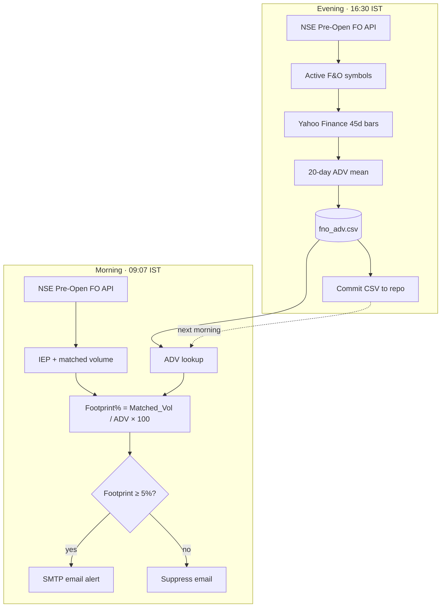

# trade_bot

NSE F&O pre-open institutional footprint monitor. GitHub Actions runs two weekday phases: evening ADV harvest, morning pre-open scan with email alerts.

## How it works

| Piece | Role |
|---|---|
| `generate_adv.py` | Builds `fno_adv.csv` (Symbol → 20Day_ADV) |
| `pre_open_monitor.py` | Live pre-open scan + ≥5% footprint filter + email |
| `.github/workflows/main.yml` | Cron orchestration for both phases |
| `graphify-out/` | Knowledge graph of architecture (`graph.html`, `GRAPH_REPORT.md`) |

## Secrets

Set GitHub Actions secrets: `SENDER_EMAIL`, `SENDER_PASSWORD`, `RECEIVER_EMAIL`.
